# EDA_1 — What Drives NFL Wins

**Target:** win/loss, one row per team-game.
**Data:** 2,710 team-game rows, 2021–2025 regular season (1,359 games × 2, minus 4 ties).
**Generated by:** `python EDA/eda_1.py --all`. Every figure has its numbers in `data/`
and its stdout in `logs/`.

---

## The headline

**Nothing in this feature set beats the closing line.** Individually the features
behave exactly as football sense predicts — QB EPA advantage, offensive efficiency
and defensive EPA allowed all separate winners from losers cleanly. But once the
closing spread is partialled out, **0 of 55 features survive a Benjamini-Hochberg
correction**, and adding any of them to a spread-only logistic regression *lowers*
2025 holdout AUC.

That is a real result, not a failed run: the NFL closing line already prices
QB quality, team efficiency and injuries. Finding edge will require something this
feature set does not contain — see [What to do next](#what-to-do-next).

---

## 01 — Baselines any model must beat

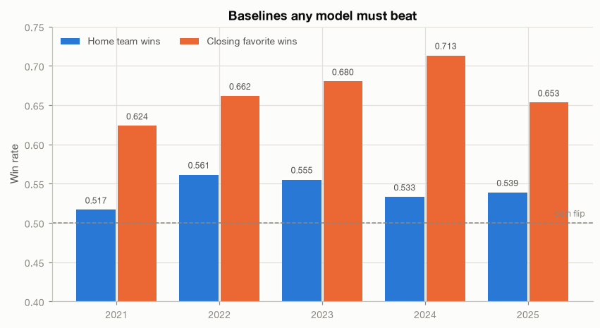

Two reference lines for everything that follows, per season:

| Baseline | Rate |
|---|---|
| Overall win rate (sanity check — must be exactly 0.5) | 0.5000 |
| Home team wins | 0.5410 |
| **Closing favorite wins** | **0.6664** |

The overall rate being exactly 0.500 confirms the panel is built correctly: every
game contributes one winner and one loser.

Home-field advantage is real but modest (54.1%) and has drifted down from its
historical ~57%. **The number that matters is 66.6%** — that is what you get by
blindly betting the favorite, and it is the bar for "does my model know anything."
Predicting wins at 60% accuracy sounds good and is actually *worse than the market*.

---

## 02 — Univariate: which features separate winners from losers at all

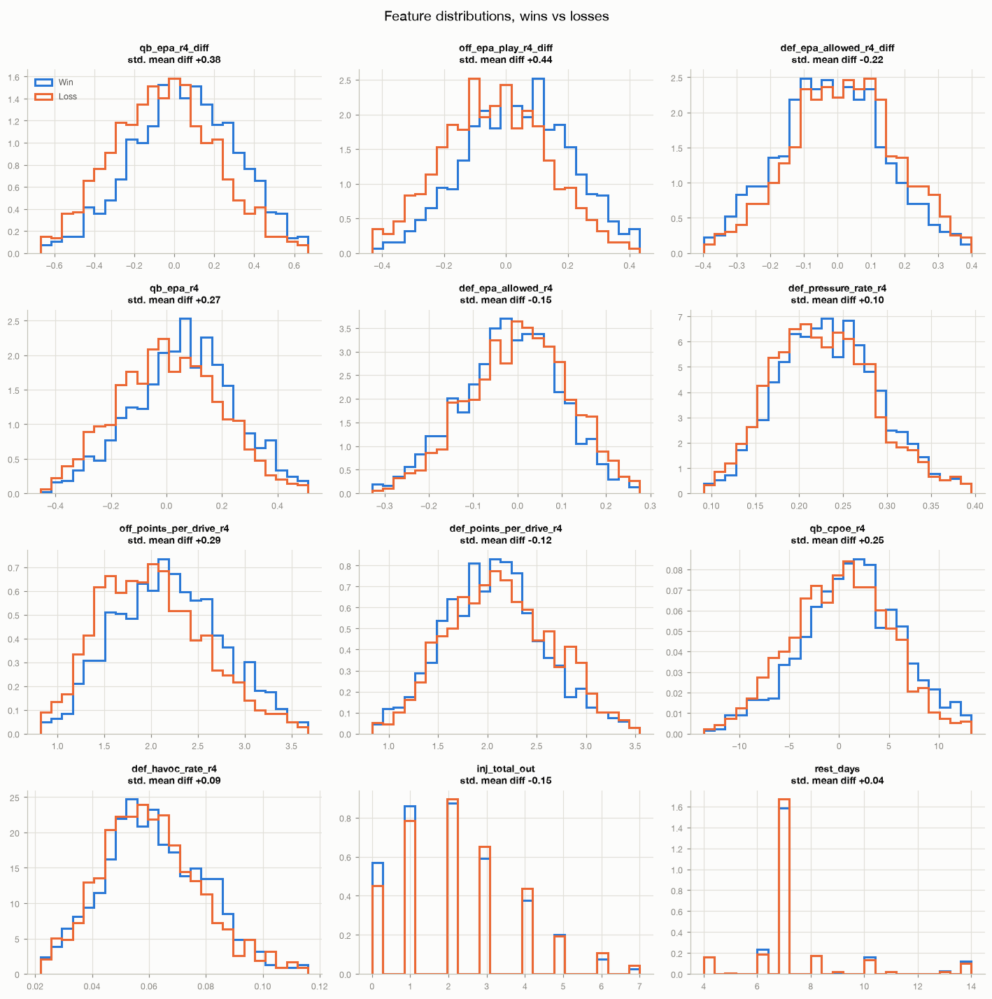

Twelve candidate features, win distribution (blue) against loss distribution
(orange), with the standardised mean difference in each title. Ranked by AUC:

| Feature | AUC | Read |
|---|---|---|
| `off_epa_play_r4_diff` | 0.627 | Offensive EPA edge is the strongest single signal |
| `qb_epa_r4_diff` | 0.613 | QB EPA edge close behind |
| `off_points_per_drive_r4` | 0.590 | |
| `qb_epa_r4` | 0.583 | Own QB alone, without the opponent adjustment, is notably weaker |
| `qb_cpoe_r4` | 0.569 | |
| `def_pressure_rate_r4` | 0.534 | Defensive pressure is weak on its own |
| `def_epa_allowed_r4` | 0.455 | Below 0.5 **because lower is better** — inverted, this is 0.545 |
| `def_epa_allowed_r4_diff` | 0.435 | Inverted: 0.565, the strongest defensive feature |

Two things to take away. First, **differential features beat absolute ones every
time** — `qb_epa_r4_diff` (0.613) versus `qb_epa_r4` (0.583). Football is a
matchup; a good QB facing a better one is not an advantage. Second, defensive
features read "backwards" only because low EPA allowed is good; the sign is
flagged in `data/04_defense.csv` via `lower_is_better`.

---

## 03 — QB EPA advantage, the headline feature

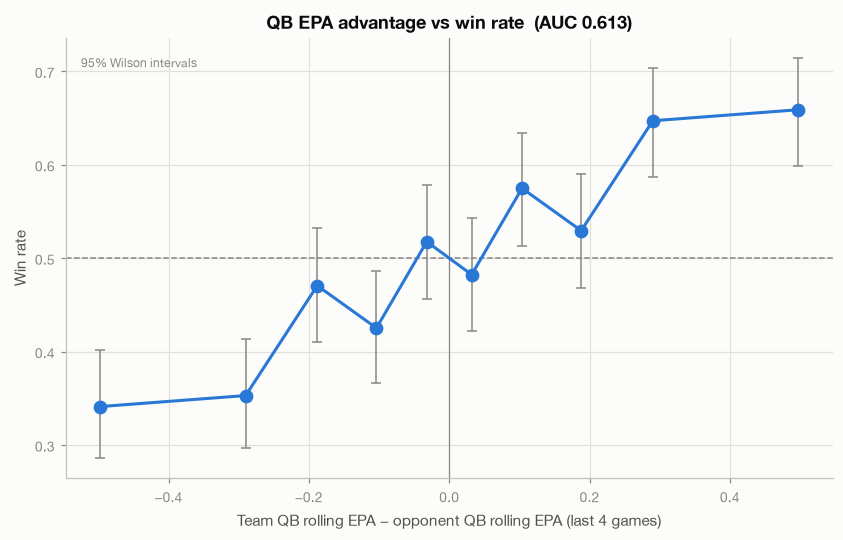

`team_QB_rolling_EPA − opponent_QB_rolling_EPA` over the trailing 4 games, split
into deciles, with 95% Wilson intervals.

The relationship is **monotone and large**: the bottom decile wins 34.1% of the
time, the top decile 65.9% — a 32-point swing from QB play alone. AUC 0.613.

Comparisons worth noting:

| Feature | AUC |
|---|---|
| `qb_epa_r8_diff` (8-game window) | **0.636** |
| `qb_epa_r4_diff` (4-game window) | 0.613 |
| `qb_cpoe_r4_diff` | 0.601 |
| `qb_epa_r4` (no opponent adjustment) | 0.583 |
| *closing spread* | *0.724* |

**The 8-game window beats the 4-game window.** QB performance is noisy enough that
a longer window is the better estimate of true quality — worth remembering when
choosing windows for modeling. But the spread still beats all of them, which is the
theme of this whole report.

---

## 04 — Defense

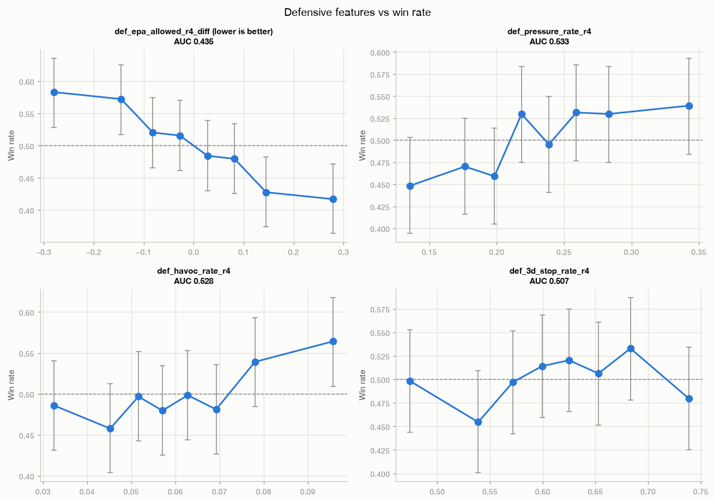

Four defensive features against win rate, in deciles. Full AUC table in
`data/04_defense.csv`.

`def_epa_allowed_r4_diff` is the strongest defensive feature (AUC 0.435, i.e. 0.565
inverted). Pressure and havoc rate are weak as main effects (0.534 and 0.528) —
generating pressure matters less than what the defense allows overall.

The `def_pressure_to_sack_r4` conversion rate is essentially noise (0.486). Pressure
that does not convert is largely a coaching/scheme artifact rather than a stable
team quality.

---

## 05 — Injuries and roster churn

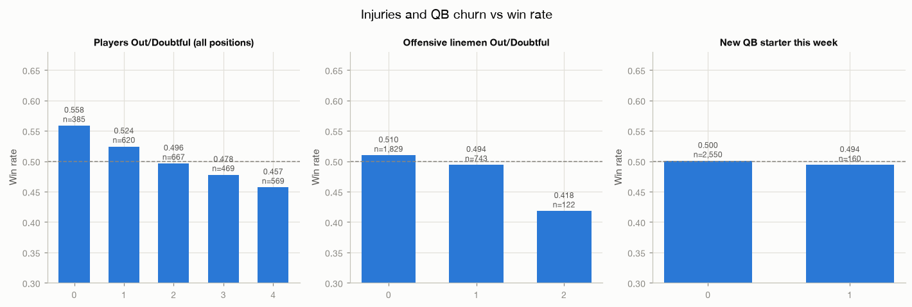

**The single largest effect in this entire report:**

| QBs listed Out/Doubtful | n | Win rate |
|---|---|---|
| 0 | 2,499 | **0.513** |
| 1 | 205 | **0.346** |

Losing your quarterback costs roughly **17 percentage points** of win probability.
Nothing else in this dataset moves the needle that hard.

By contrast, the `qb_is_new_starter` flag shows almost nothing (0.494 vs 0.500).
The flag fires on *any* starter change, including planned ones and backups who were
already playing well; it does not isolate the "starter is hurt" case that actually
matters. The injury report does that far better. **Verdict: keep `inj_qb_out`, drop
`qb_is_new_starter` as specified.**

> **Methodological catch worth flagging.** `qb_is_new_starter` is *constant* in the
> complete-case matrix used by §09. A brand-new starter has no prior starts, so his
> rolling QB features are null and the row is dropped — the complete-case analysis
> structurally excludes exactly the cases the feature exists to study. This is why
> it shows as a blank row in the correlation matrix, and why churn features must be
> evaluated on the full panel (as this section does), never on complete cases.

---

## 06 — Situational context

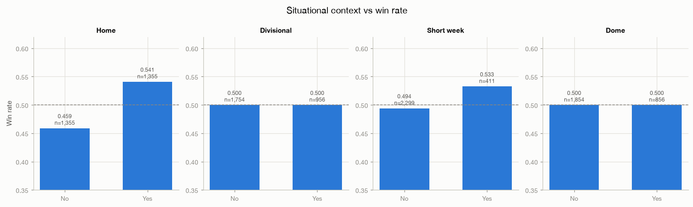

| Feature | AUC |
|---|---|
| `is_home` | 0.541 |
| `tz_shift` | 0.511 |
| `short_week` | 0.510 |
| `rest_days` | 0.501 |
| `div_game` | **0.500** |
| `is_dome` | **0.500** |
| `wind` | **0.500** |
| `travel_miles` | 0.466 |

**The exact 0.500s are not a bug — they are structural**, and this is the most
important methodological lesson in the report. `div_game`, `is_dome`, `wind` and
`total_line` are *symmetric*: both teams in a game share one value (verified — max
one distinct value per game). In a team-game panel one of those two rows is always
a win and the other always a loss, so a symmetric feature **cannot** predict the
winner. Its AUC is 0.500 by construction.

This does not make weather or divisional games irrelevant to football. It means they
can only enter the model as **interactions** with an asymmetric feature (wind ×
pass-heavy offense), never as main effects. Any symmetric feature showing a non-0.5
AUC would indicate a bug in the panel.

`travel_miles` at 0.466 is just `is_home` wearing a disguise — only away teams
travel, so it encodes home/away and nothing more.

---

## 07 — The market baseline

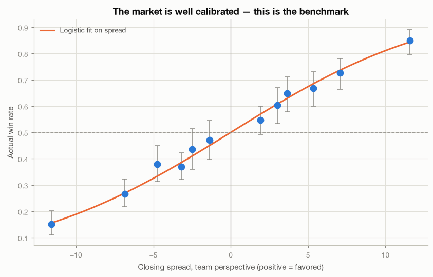

Actual win rate by closing spread decile, against a logistic fit.

**The market is extremely well calibrated.** Points sit on the fitted curve across
the whole range; there is no spread band where the favorite systematically over- or
under-performs its price. Closing spread AUC is **0.724**, and the moneyline implied
probability gives an identical 0.724 — they carry the same information.

This is the benchmark. Everything in §10 is measured against it.

---

## 08 — Interaction checks

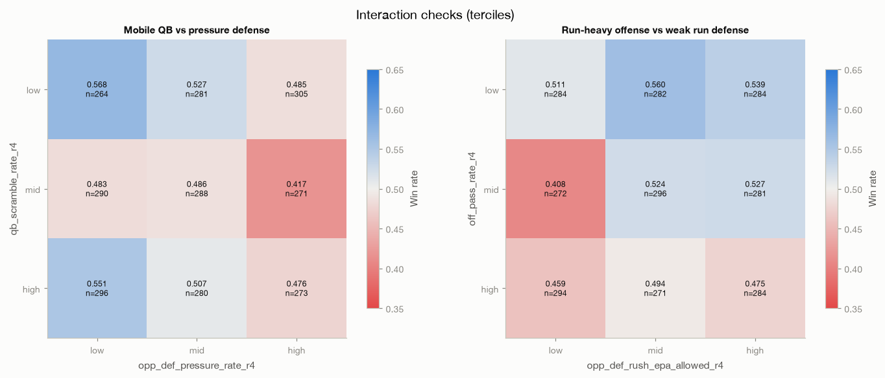

Win rate by tercile × tercile, diverging color scale centred on 0.500.

**Mobile QB × pressure defense.** The clean pattern is in the *column*, not the
interaction: facing a high-pressure defense drops win rate regardless of QB
mobility (low-mobility QBs 0.568 → 0.487; high-mobility 0.553 → 0.472). Mobility
does **not** rescue a QB from pressure the way the conventional wisdom claims — the
high-mobility/high-pressure cell (0.472) is no better than the low-mobility one
(0.487).

**Run-heavy offense × weak run defense.** No coherent interaction; the surface is
noisy with the worst cell (0.408) in the middle of the grid, which is a hallmark of
noise rather than signal. Cell sizes are ~250–290, so single cells move by chance.

**Verdict: DROP both interactions.** Neither earns its complexity.

---

## 09 — Correlation and mutual information

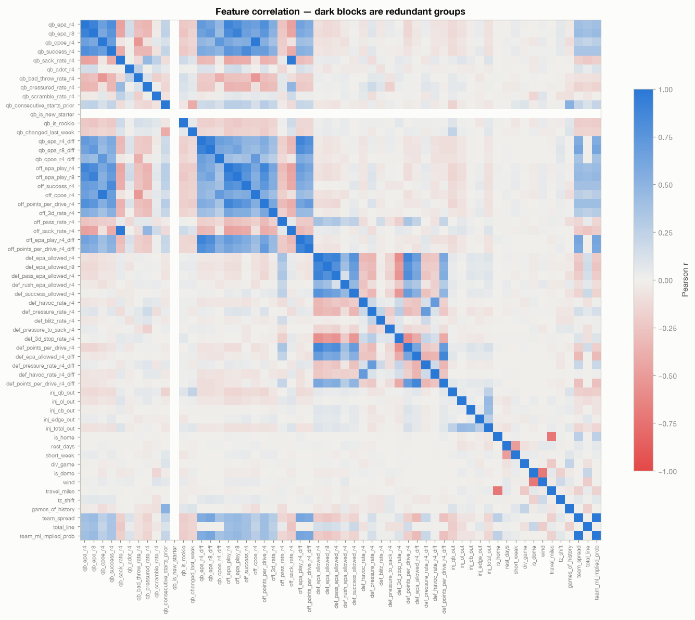

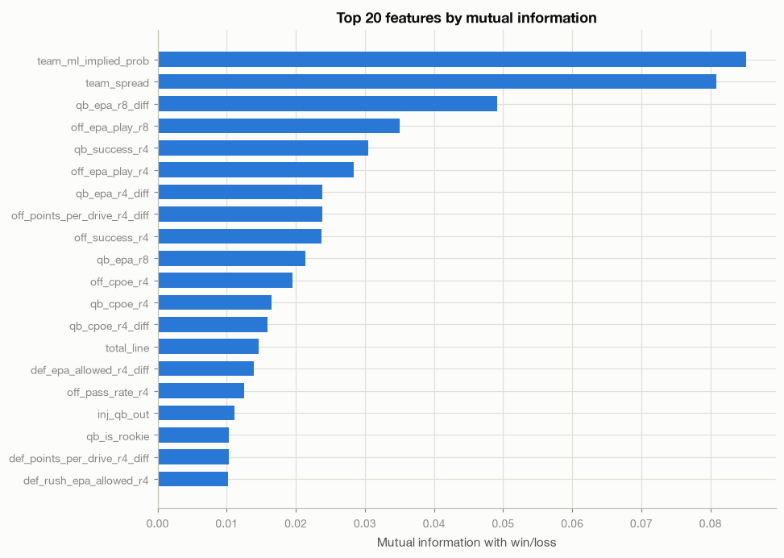

Complete-case matrix over 55 features (2,290 rows).

The correlation heatmap shows three obvious redundancy blocks — QB features, offense
features and defense features each correlate heavily within themselves. `team_spread`
and `team_ml_implied_prob` are near-perfectly correlated; **use one, never both.**

Mutual information ranks `team_ml_implied_prob` (0.085) and `team_spread` (0.081)
far above everything else, with `qb_epa_r8_diff` (0.049) the best non-market feature.
The market features dominating the MI ranking is itself the finding: the line carries
more information about the outcome than any football statistic computed here.

The blank `qb_is_new_starter` row is the complete-case artifact explained in §05.

---

## 10 — Market-independence screen: the edge test

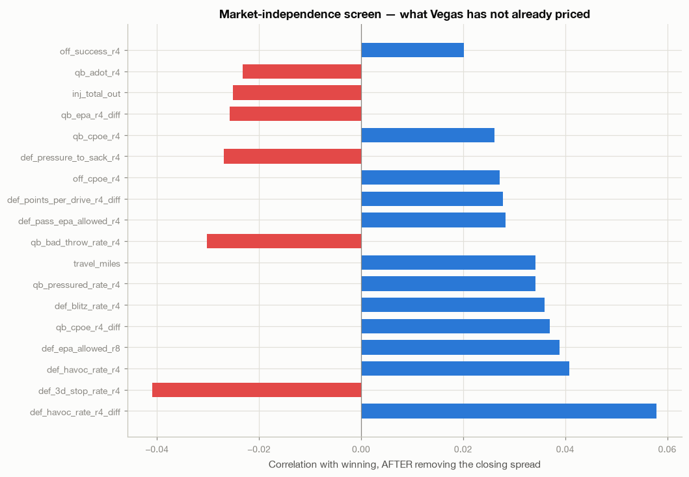

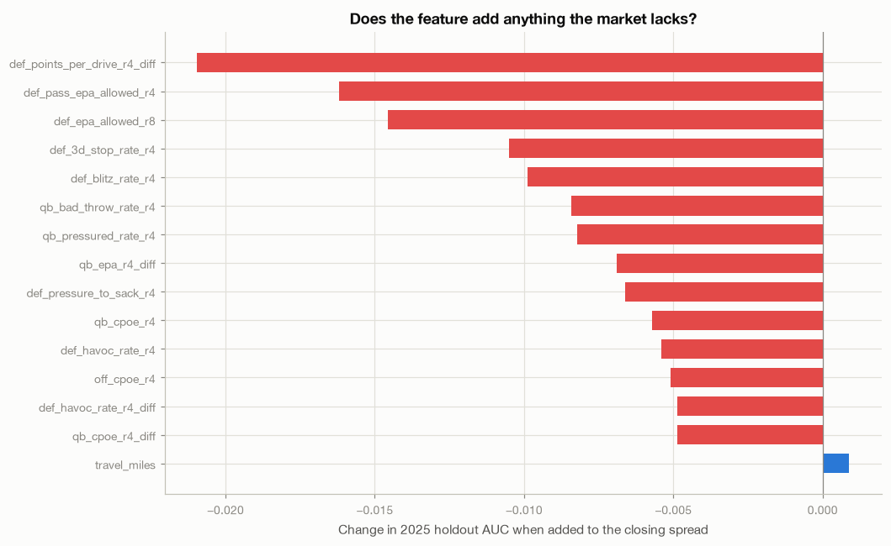

**This is the section that decides whether any of this can make money.**

A feature that merely re-derives what Vegas already prices cannot produce edge no
matter how predictive it looks in §02–§04. So each feature is regressed on the
closing spread, and only the *residual* — the part the market has not priced — is
tested against the outcome.

The result is unambiguous and negative:

- **0 of 55 features survive Benjamini–Hochberg correction** on the residual.
- The best raw candidate, `def_havoc_rate_r4_diff`, has residual r = 0.058
  (p = 0.0034) — nominally significant, but not after correcting for 55 tests.
- `qb_epa_r4_diff` correlates **0.539 with the closing spread**. Its raw AUC of
  0.613 is almost entirely information the market already has; its residual
  correlation is −0.026.

The incremental test settles it. Training a logistic regression on 2021–2024 and
testing on 2025:

| Model | 2025 holdout AUC |
|---|---|
| Closing spread alone | **0.7187** |
| + `travel_miles` | 0.7196 (+0.0009) |
| + `qb_cpoe_r4_diff` | 0.7139 (−0.0049) |
| + `def_havoc_rate_r4_diff` | 0.7139 (−0.0049) |
| + `qb_epa_r4_diff` | 0.7118 (−0.0069) |

Every football feature *hurts* out-of-sample performance. The lone positive,
`travel_miles` at +0.0009, is far inside noise on a 544-row test set and is a proxy
for home-field anyway.

---

## Verdicts

| Feature group | Verdict | Reason |
|---|---|---|
| QB EPA differential (`qb_epa_r8_diff`) | **ADOPT** | Best non-market feature (AUC 0.636); use the 8-game window |
| `inj_qb_out` | **ADOPT** | Largest effect in the report (−17pp); market may under-price late news |
| Offensive EPA differential | **ADOPT-MODIFIED** | Strong (0.627) but 0.5+ correlated with spread — keep one, not the whole block |
| Defensive EPA allowed differential | **ADOPT-MODIFIED** | Best defensive signal; heavily redundant with offense block |
| `team_spread` **or** `team_ml_implied_prob` | **ADOPT (one only)** | Near-perfectly correlated |
| Pressure / havoc / blitz rates | **DROP** | Weak main effects, no residual signal |
| `qb_is_new_starter`, `qb_changed_last_week` | **DROP** | No effect; `inj_qb_out` captures the real case |
| Symmetric context (`div_game`, `is_dome`, `wind`, `total_line`) | **DROP as main effects** | AUC 0.500 by construction in a team-game panel |
| `travel_miles`, `tz_shift` | **DROP** | Proxies for `is_home` |
| Both tested interactions | **DROP** | No coherent signal |

---

## What to do next

The modeling phase should start from an honest premise: **beating the closing line
with post-game box-score aggregates is not going to work.** The line already
contains them. Three directions actually have a chance:

1. **Beat the line on timing, not information.** Compare opening lines to closing
   lines. If a feature predicts *line movement*, that is tradeable even when it does
   not predict the outcome better than the close. The database has closing lines
   only — capturing openers going forward is a prerequisite.
2. **Target the news the market prices slowly.** `inj_qb_out` is the standout effect
   here. The question is not "does a QB injury matter" (obviously yes, −17pp) but
   "how fast does the line absorb it." That needs line snapshots timestamped against
   injury-report releases.
3. **Model a different target.** Totals and player props are less efficient than
   sides. The current schema already supports totals work.

A logistic-regression baseline on the ADOPT features is still worth building as a
reference point — but it should be evaluated against the 0.7187 spread-only AUC,
and expected to lose.

### Caveats

- 2,710 team-game rows is small. The 2025 holdout is 544 rows; AUC differences
  under ~0.02 are not meaningful.
- Weather is partially missing: `temp`/`wind` are absent for many outdoor games in
  2022–23 (2022 has temp for only 107 of 198). `is_dome` has full coverage, and the
  symmetry problem in §06 limits weather's usefulness regardless.
- Injury reports are joined at week granularity. A player listed Out on Wednesday
  and one ruled out Sunday morning are treated identically, which understates how
  much late news is worth.
- The leakage guard (`python -m src.features --verify-leakage`) passes and was
  itself verified by injecting both a same-game leak and an off-by-one shift error,
  each of which it caught.
