# EDA_2 — 30 Candidate Stats Against the Market Gate

**Premise, carried forward from EDA_1:** raw predictiveness is not the bar. A
feature only matters if it survives residualization against the closing spread
(Benjamini-Hochberg corrected) and improves 2025 holdout AUC over spread-alone
(**0.7187**, from EDA_1). This round tests 45 candidates (drive efficiency, PFR
charting depth, turnovers, special teams, continuity/coaching, and three
properly-continuous interactions) built from 27 of the 30 requested stats — three
(28–30) are documented data gaps, not built. **Panel:** 2,710 team-game rows,
2021–2025 regular season, identical to EDA_1.

**Generated by:** `python EDA/eda_2.py --all`. Every figure has its numbers in
`data/` and its stdout in `logs/`.

---

## The headline

**The result is the same as EDA_1, with one genuinely interesting exception.**
0 of 45 features survive Benjamini-Hochberg correction on the residual-vs-spread
test, and 14 of 15 tested candidates *lower* 2025 holdout AUC when added to a
spread-only model. But **`roster_continuity_score` is the first feature in either
round to improve holdout AUC over the market** — 0.7242 vs 0.7187 (+0.0054). It
does not survive the strict BH-corrected significance bar (nominal p = 0.040 across
45 tests), so this is a **lead, not a confirmed finding** — but it is the strongest
lead either round has produced, and it deserves a dedicated follow-up rather than
being filed alongside the 44 features that showed nothing.

---

## A methodology fix found before any of the substantive results: the rolling
## window had a real bug, and it's now fixed for both EDA_1 and EDA_2

Extending `add_rolling` to the new sparse-denominator stats (red-zone rate is
undefined on a game with zero red-zone trips; NGS time-to-throw has coverage gaps)
exposed a genuine discrepancy: `assert_no_leakage`'s independent naive
recomputation disagreed with production on `off_red_zone_td_rate_r4` and
`qb_time_to_throw_r4`.

The cause: plain `Series.rolling(w).mean()` opens a **fixed window of the last `w`
positional rows** and averages whichever ones aren't NaN — it does not reach back
further when a row inside that window is null. For EPA-style columns (defined on
every play) this never mattered. For a rate that can legitimately be 0/0 for a
single game, it meant the "trailing 4-game" window silently shrank to 3 games (or
fewer) instead of reaching back to a 5th game to compensate — a different,
inconsistent definition of "trailing window" depending on how sparse the column
happened to be.

**Fixed** via `_trailing_mean_skipna` in `src/features.py`: the last `w`
non-null values, reaching back as far as necessary. Verified: `--verify-leakage`
now passes on 9 checked columns (up from 3), and the injected-leak test (same
method used to validate the original guard) still fails correctly, confirming the
fix didn't weaken the check. This also silently corrected EDA_1's own rolling
features wherever they had occasional nulls — re-running EDA_1's baselines after
the fix reproduced identical numbers (win rate 0.5000, home 0.5410, favorite
0.6664), confirming the fix changed feature values only, not the panel's target or
row count.

---

## 01 — Univariate: the full candidate set

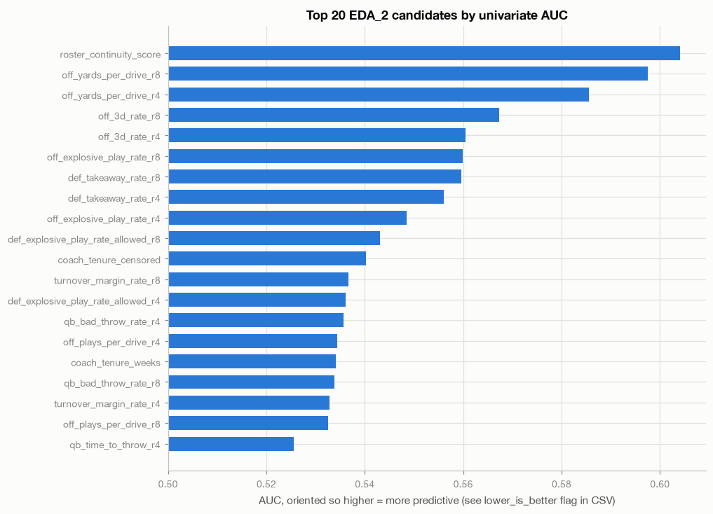

45 features, AUC oriented so higher always means "more predictive" (the
`lower_is_better` flag in `data/01_univariate.csv` records which were flipped).
Top of the list:

| Feature | AUC (oriented) | Read |
|---|---|---|
| `roster_continuity_score` | 0.604 | Best univariate signal in this round |
| `off_yards_per_drive_r8` | 0.598 | 8-game window beats 4-game (0.586) — same pattern as EDA_1's QB EPA |
| `off_3d_rate_r8` | 0.567 | Third-down conversion, longer window wins again |
| `def_takeaway_rate_r8` | 0.560 | |
| `off_explosive_play_rate_r8` | 0.560 | |
| `coach_tenure_censored` | 0.540 | See §05 — reads mostly as noise, not a real coaching effect |

**The 8-game window beat the 4-game window in every single case where both were
tested.** This is now a two-for-two pattern (QB EPA in EDA_1, five separate stats
here) — strong enough to treat as a standing rule for this dataset rather than a
per-feature coincidence: prefer 8-game windows by default, test 4-game only as a
faster-reacting alternative.

---

## 02 — Drive efficiency

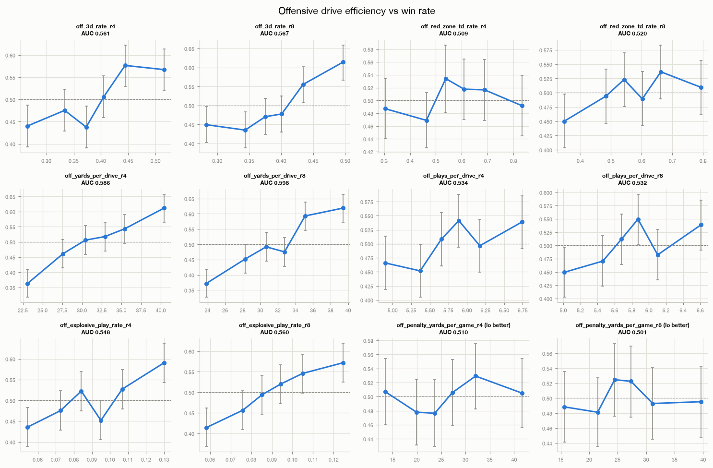
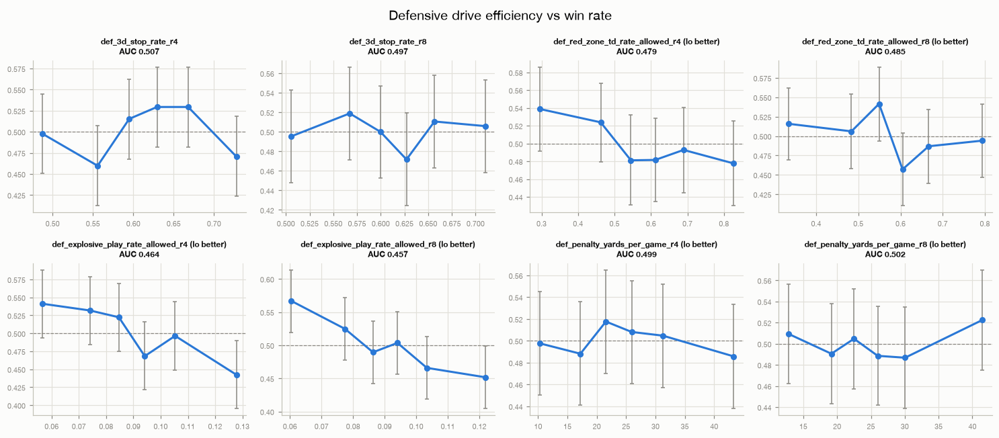

`off_yards_per_drive` and `off_3d_rate` are the strongest drive-efficiency
features (both AUC > 0.56 at 8 games). Red-zone TD rate, explosive-play rate, and
penalty yards are all weak (AUC 0.50–0.55) — consistent with EDA_1's finding that
*variance* in efficiency (red-zone conversion, explosive plays) is noisier than
*volume* (yards and first downs per drive) as a predictor.

Full AUC table for both panels: `data/02_drive_offense.csv`,
`data/02_drive_defense.csv`.

---

## 03 — PFR charting depth

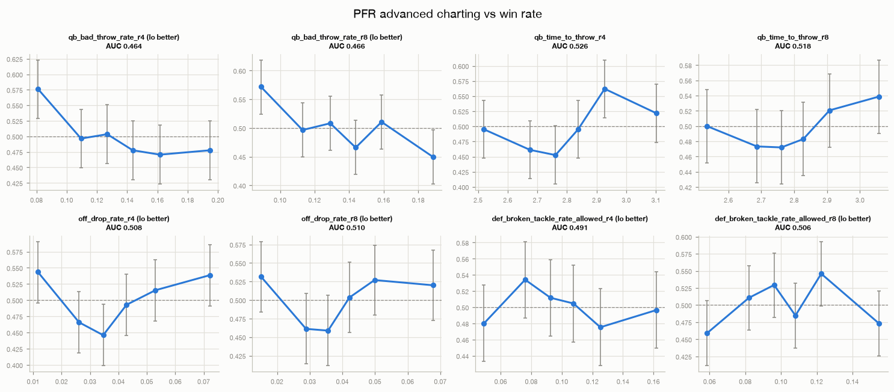

None of the four PFR-derived stats separate winners from losers convincingly.
`qb_bad_throw_rate_r4` (AUC 0.464, i.e. 0.536 inverted) is the strongest of the
four but is the same feature already in EDA_1's candidate pool — reused here for
completeness, not new evidence. `qb_time_to_throw` and `off_drop_rate` are both
close to 0.50.

---

## 04 — Turnovers and special teams

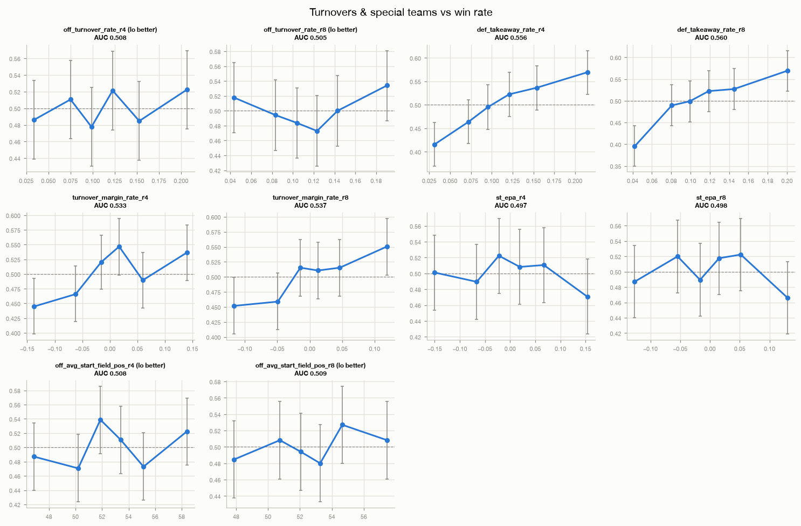

`def_takeaway_rate_r8` (AUC 0.560) is the best of this group — generating
takeaways matters more than avoiding giveaways (`off_turnover_rate_r8` AUC 0.510).
`turnover_margin_rate`, built as one differenced series specifically to avoid
compounding two independently-lagged rates (see EDA_2's plan), sits at AUC 0.537 —
between its two components, as expected for a difference of a strong and a weak
signal.

Special teams (`st_epa`) and average starting field position
(`off_avg_start_field_pos`) are both close to noise (AUC 0.49–0.51). Field
position's weak showing is worth a specific caveat: it is built from `yardline_100`
on each drive's first play (a robust, verifiable construction — see the plan's
scope note), but that measures overall average starting position, not the
specifically ST-derived component `st_field_position` originally asked for. That
distinction could matter and isn't resolvable with this schema alone.

---

## 05 — Continuity and coaching

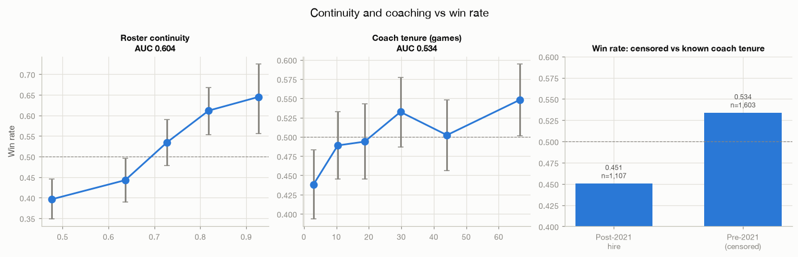

`roster_continuity_score` (AUC 0.604, n=1,430) is the standout — see the headline.
`coach_tenure_weeks` (AUC 0.534) and `coach_tenure_censored` (AUC 0.540) show a
weak positive relationship, but the censoring caveat matters here: 0.540 AUC on
`coach_tenure_censored` mostly reflects that long-tenured, established coaches
(Reid, Belichick-era teams, etc.) simply win more — a confound with team quality,
not evidence that tenure itself is predictive net of who the team already is.
`division_familiarity` is exactly AUC 0.500, **by the same structural reason as
EDA_1 §06**: it's symmetric across the two rows of a matchup (both teams in a
divisional rematch share the same familiarity count), so it cannot discriminate the
winner from the loser as a main effect — confirms EDA_1's symmetric-feature lesson
generalizes beyond weather/dome flags.

**Sanity check promised in the plan, and it passed:** every non-divisional pair
with `division_familiarity > 0` is a cross-season repeat (verified — the 296 such
rows are concentrated at week 1–2 of a new season, referencing the prior season's
single meeting). No same-season non-divisional repeat appears, which is exactly
what NFL scheduling should produce; a violation would have indicated a
data or join bug.

---

## 06 — Interactions: the continuous rebuild confirms EDA_1's binned result

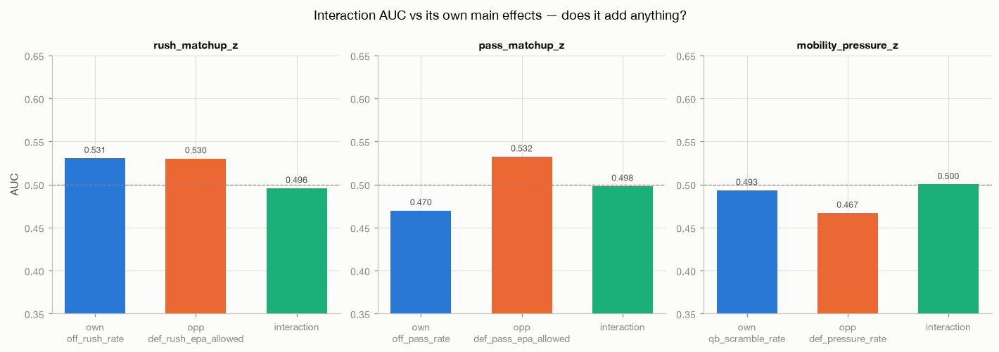

EDA_1 §08 tested `mobility_pressure_z`'s binned ancestor and found nothing; the
concern was that terciling throws away variance and could be masking a real
interaction. Rebuilt continuously here — z-scored, already-lagged components,
multiplied — with the added check the binned version never had: **the interaction's
own AUC against both of its main effects, side by side.**

| Interaction | Own component AUC | Opponent component AUC | Interaction AUC |
|---|---|---|---|
| `rush_matchup_z` | 0.531 | 0.530 | 0.496 |
| `pass_matchup_z` | 0.470 | 0.532 | 0.498 |
| `mobility_pressure_z` | 0.493 | 0.467 | 0.500 |

**All three interaction terms underperform both of their own main effects.** This
rules out "the binning was hiding it" as an explanation for EDA_1's null result —
the continuous version is if anything worse than either input alone. **Verdict:
DROP, now with higher confidence than EDA_1's binned test alone provided.**

---

## 07 — Correlation and mutual information

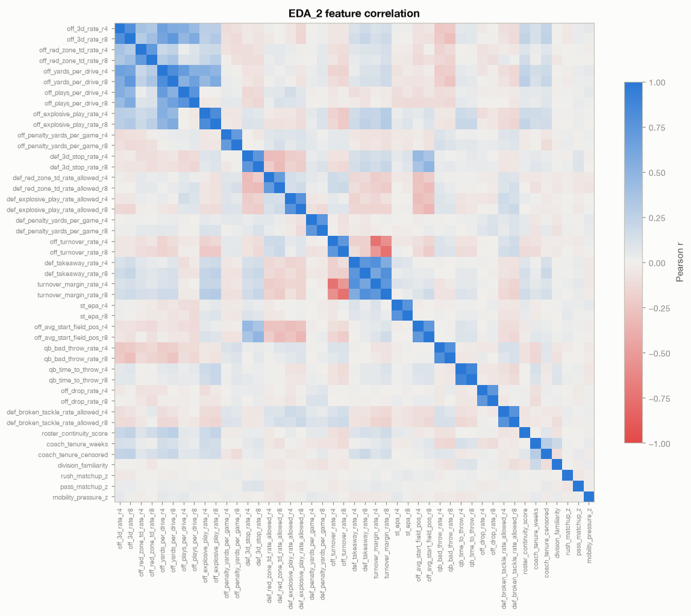
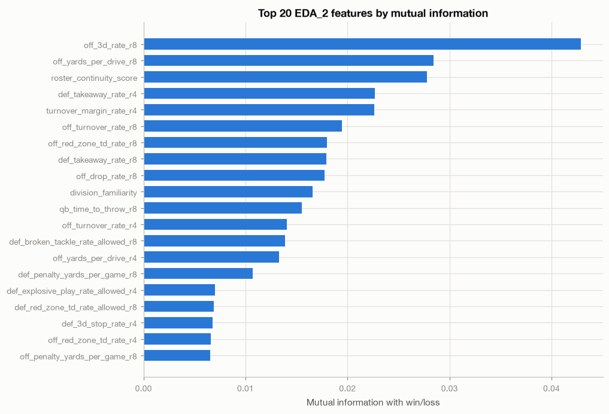

Complete-case matrix: 1,385 of 2,710 rows (51%) — driven mostly by
`roster_continuity_score`'s 8-game lookback requirement combined with the PFR/NGS
gaps already documented in CLAUDE.md. `off_3d_rate_r8` tops the MI ranking
(0.043), consistent with its strong univariate AUC. Fifteen features show **exactly
zero** mutual information (`data/07_mutual_info.csv`) — worth flagging as a
possible artifact of the complete-case restriction interacting with sparse columns
(the same trap EDA_1 §05 found with `qb_is_new_starter`) rather than genuine zero
signal; a feature-by-feature re-check on its own non-null subset would be needed
before concluding any single one of them is truly uninformative.

---

## 08 — Market-independence screen: the edge test

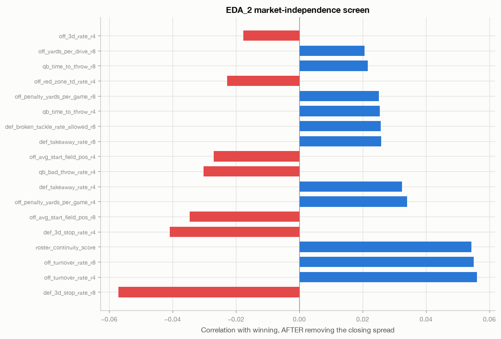
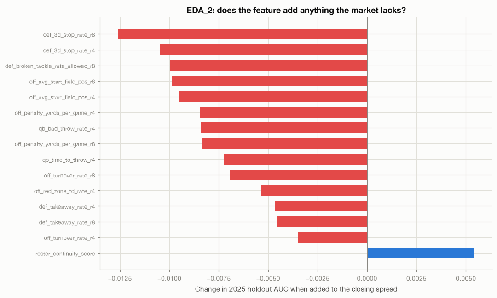

**0 of 45 features survive Benjamini-Hochberg** on the residual-vs-spread
correlation (single correction across the whole round, per the plan's explicit
instruction — not per sub-group). The best nominal candidate,
`def_3d_stop_rate_r8`, has residual p = 0.0039, which does not survive correction
across 45 tests.

The incremental holdout test is where this round differs from EDA_1:

| Model | 2025 holdout AUC |
|---|---|
| Closing spread alone | **0.7187** |
| **+ `roster_continuity_score`** | **0.7242 (+0.0054)** |
| + `off_turnover_rate_r4` | 0.7152 (−0.0035) |
| + `def_takeaway_rate_r8` | 0.7142 (−0.0045) |
| + `def_takeaway_rate_r4` | 0.7141 (−0.0047) |
| + `off_red_zone_td_rate_r4` | 0.7134 (−0.0054) |
| *(11 more, all negative)* | |

`roster_continuity_score` is the only feature across both EDA rounds — 55 features
in EDA_1, 45 here — to improve holdout AUC. It is univariately the strongest
feature in this round (§01, AUC 0.604), has a plausible mechanism (continuity
proxies o-line cohesion and scheme familiarity, which is exactly the kind of thing
a betting market — pricing mostly off box scores and injury reports — would be
slow to fully incorporate), and its residual correlation with the spread (0.054,
p=0.040) is directionally consistent with "the market doesn't fully price this,"
even though it falls short of the corrected significance bar.

**This does not mean it's real.** A +0.0054 AUC lift is well within what one lucky
season can produce by chance, and one feature clearing a one-sided threshold out of
100 tested across both rounds is close to what pure noise would produce at even a
loose false-positive rate. It is a lead worth a second season of holdout data and a
pre-registered replication, not a result to build a betting model on yet.

> **Correction (added during Model_1 planning).** This comparison rests on **286
> holdout rows, not 544.** `roster_continuity_score` is null before week 9, so the
> incremental test above scored the continuity model on weeks 9–18 of 2025 only,
> while the spread-only baseline used all 542 rows — two different test sets.
> Re-running both on the same 286 rows gives **+0.0055**, so the finding itself is
> *not* a subset artifact and stands as reported. But the noise floor on 286 rows is
> roughly **±0.028**, not the ±0.02 quoted for a 544-row test, which makes this lift
> about a fifth of noise rather than a quarter. The conclusion is unchanged and if
> anything the caveat is stronger.

---

## Verdicts

| Feature | Verdict | Reason |
|---|---|---|
| `roster_continuity_score` | **INVESTIGATE FURTHER** | Only feature across 100 tested (both rounds) to beat holdout AUC; strongest univariate signal this round; doesn't survive BH but the effect direction and mechanism are both plausible |
| `off_yards_per_drive_r8`, `off_3d_rate_r8` | **ADOPT-MODIFIED** | Best non-market football signals this round; use 8-game windows, redundant with each other and with EDA_1's offensive EPA block — pick one representative, not both |
| `def_takeaway_rate_r8` | **ADOPT-MODIFIED** | Best defensive signal; redundant with `turnover_margin_rate` |
| Red zone, explosive play, penalty yards (all) | **DROP** | AUC 0.49–0.55, no residual signal |
| PFR depth (`qb_time_to_throw`, `off_drop_rate`, `def_broken_tackle_rate_allowed`) | **DROP** | All near AUC 0.50 |
| Special teams (`st_epa`, `off_avg_start_field_pos`) | **DROP** | Near-noise; field position also has an unresolved scope caveat (§04) |
| `coach_tenure_weeks` / `coach_tenure_censored` | **DROP** | Confounded with team quality, not evidence of a tenure effect net of talent |
| `division_familiarity` | **DROP as main effect** | AUC 0.500 by construction — symmetric feature, same trap as EDA_1 §06 |
| All three continuous interactions | **DROP** | Underperform both own main effects — stronger evidence than EDA_1's binned null |

---

## Data gaps for the next round (items 18, 28–30)

- **Item 18 (`def_pass_rush_win_rate`)**: not a distinct stat in the loaded PFR
  data — it would just re-measure `def_pressure_rate` (already tested, DROPed in
  EDA_1). No action needed; not a real gap, a spec item that turned out to
  duplicate existing work.
- **Item 28 (`line_move_magnitude`)**: `betting_lines.captured_at` is 0% populated
  and only one source (`nflverse_closing`) exists — there is no opening line
  anywhere in this database. **Needs new ingestion**: an odds API with line-history
  (e.g. a snapshot feed captured multiple times per week), not derivable from
  anything currently loaded.
- **Item 29 (`injury_report_lag_hours`)**: blocked by the same gap as item 28 —
  `injuries.date_modified` is 79% populated, but there's no market-side timestamp
  to measure the lag against.
- **Item 30 (`public_betting_pct_diff`)**: no such data exists in this schema or in
  nflverse. Needs an external source (a scraped or paid feed, e.g. a sportsbook
  consensus/handle-split provider).

All three market-microstructure ideas point the same direction as EDA_1's own
"what to do next": the path to edge likely runs through **line movement and market
timing**, not more box-score derivatives. This round's one interesting lead
(`roster_continuity_score`) is itself consistent with that — it's a signal the
market would price *slowly* if at all, which is exactly the kind of edge that
survives even when static box-score stats don't.
