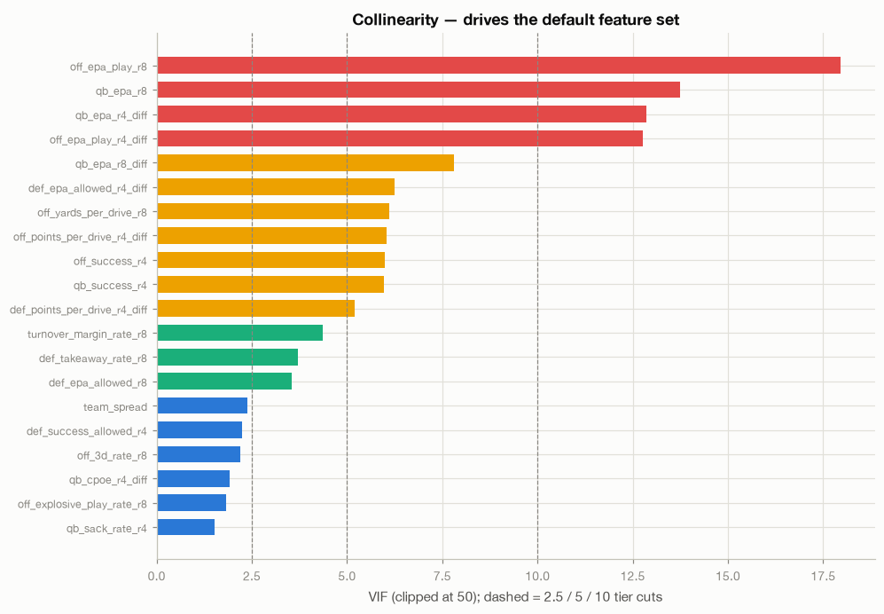
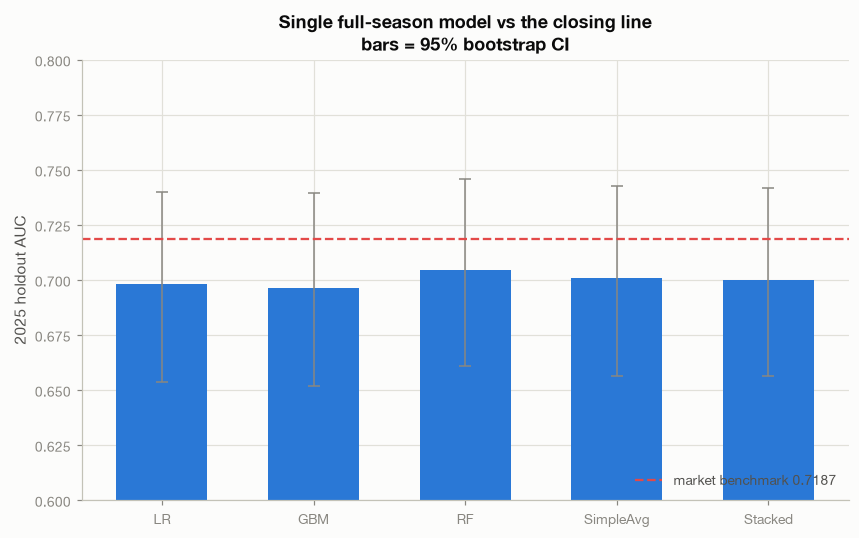
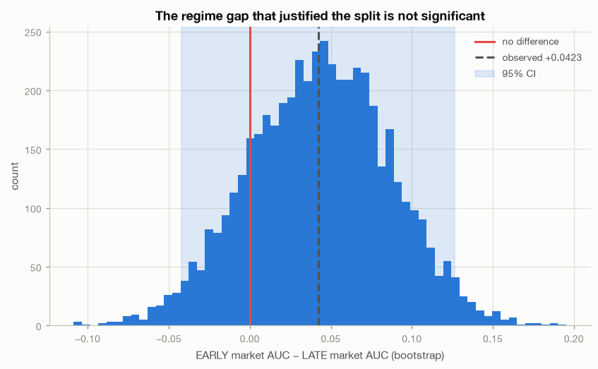
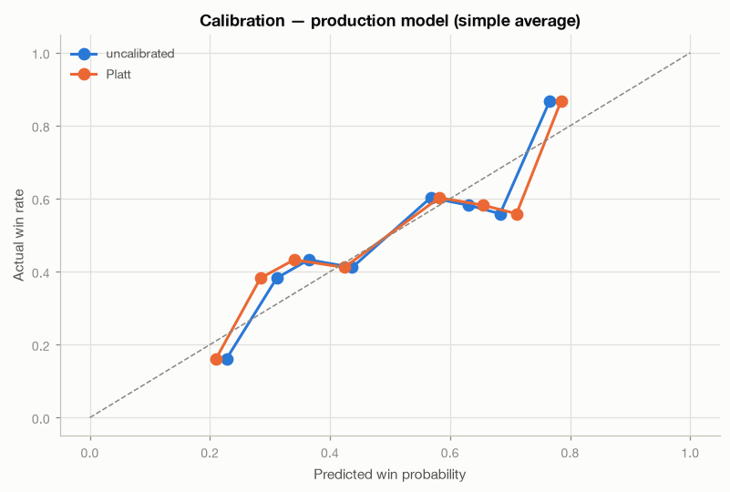

# Model_1 — LR + GBM + RF vs the Closing Line

**Revision 3.** Single full-season model. The EARLY/LATE regime split from revisions
1–2 was tested and **rejected** — §04 carries the evidence.

**Generated by:** `python Modeling/model_1.py --all`. Figures here, numbers in
`data/`, per-section stdout in `logs/`. Extended statistics via
`python Modeling/model_stats.py`.

---

## The headline

**0 of 10 configurations beat the closing spread.** The production model (simple
average, 22 features) scores **0.7007 AUC against a 0.7187 benchmark — a deficit of
0.0180**.

Revision 2 reported "1 of 20" beating the benchmark. That one winner has now
disappeared, and its disappearance is itself the finding: it was late-season LR at
+0.0017, an artifact of splitting 2,168 training rows into two smaller models. **The
split was manufacturing a false positive.** Removing it removed the only apparent
edge this project ever produced.

---

## ⚠️ Correction to revisions 1–2

Revisions 1 and 2 claimed the early/late market-efficiency gap (0.7465 vs 0.7041)
was "the most actionable observation in the report" and "an order of magnitude
larger than any model effect." **That claim was wrong.** It was never tested for
significance; it was a point estimate from a single season.

Bootstrapping the gap gives a **95% CI of [−0.042, +0.127]**, straddling zero —
16.6% of bootstrap samples show the late market as *sharper* than the early one.
There is no regime difference to exploit. The error propagated into the findings
doc, CLAUDE.md, and the project memory; all three have been corrected.

---

## 01 — Setup

| Weeks | Features | Train rows | Test rows | Spread-only benchmark | Always-pick-favorite accuracy |
|---|---|---|---|---|---|
| 1–18 (single model) | 29 | 2,168 | 542 | **0.7187** | 0.6531 |

Sanity gate passed: spread-only LR reproduces 0.7187.

---

## 02 — Collinearity defines the default feature set

29 candidates → **22 cluster representatives**, chosen by market-independent signal
rather than raw AUC. The QB/offense EPA block remains the dominant redundancy
cluster. Full labeled table (VIF, tier, cluster, representative status, L1
selection) in `data/02_collinearity_labeled.csv`.

---

## 03 — Primary models (single full-season)

| Model | Role | AUC | 95% CI | Accuracy | Brier | Log-loss | ECE | CV val | CV train | Gap | vs market |
|---|---|---|---|---|---|---|---|---|---|---|---|
| LR | single | 0.6982 | 0.654–0.740 | 0.6494 | 0.2194 | 0.6258 | 0.0622 | 0.7360 | 0.7309 | **−0.005** | −0.0205 |
| GBM | single | 0.6964 | 0.652–0.739 | 0.6531 | 0.2199 | 0.6293 | 0.0684 | 0.7207 | 0.7714 | 0.0507 | −0.0224 |
| RF | single | **0.7047** | 0.661–0.746 | 0.6531 | 0.2186 | 0.6264 | 0.0625 | 0.7266 | 0.7580 | 0.0315 | −0.0140 |
| **SimpleAvg** | **PRODUCTION** | 0.7007 | 0.656–0.743 | **0.6550** | 0.2188 | 0.6261 | 0.0691 | — | — | — | **−0.0180** |
| Stacked | comparison | 0.7002 | 0.657–0.742 | 0.6494 | 0.2246 | 0.6386 | 0.0780 | — | — | — | −0.0185 |
| *MARKET* | *benchmark* | *0.7187* | *0.676–0.760* | *0.6531* | ***0.2123*** | ***0.6094*** | ***0.0348*** | — | — | — | *0.0000* |

Selected: LR `C=0.03, l1_ratio=0.5, thresh=binary` · GBM `depth=2, lr=0.02, leaf=80,
l2=10, max_features=0.7` · RF `depth=4, leaf=50, max_features=0.6, max_samples=0.7`

**Overfitting is now under control across the board** — worst gap 0.051 (GBM),
versus 0.123 under the split. Training on all 2,168 rows instead of 978/1,190 did
what the tightened EARLY grid alone could not.

**The market still wins every probability metric**: Brier 0.2123 vs 0.2188,
log-loss 0.6094 vs 0.6261, and ECE 0.0348 vs 0.0691 — the market is roughly **twice
as well calibrated** as the production model.

Simple average beat stacking again (0.7007 vs 0.7002, with clearly better Brier and
ECE), now on a third independent run.

---

## 04 — The EARLY/LATE split: tested and rejected

| Early market AUC | Late market AUC | Observed gap | Bootstrap 95% CI | Fraction early ≤ late | Significant? |
|---|---|---|---|---|---|
| 0.7465 | 0.7041 | +0.0423 | **[−0.0421, +0.1266]** | 0.166 | **NO** |

The split's entire justification fails its own significance test. Consequences of
removing it, all measured:

| | Split (2 models) | Single model | Winner |
|---|---|---|---|
| Pooled holdout AUC | 0.7016 | 0.7052* | single |
| Accuracy | 0.6384 | 0.6531* | single |
| Log-loss | 0.6301 | 0.6236* | single |
| Brier | 0.2204 | 0.2178* | single |
| Worst overfit gap | 0.1234 | **0.0507** | single |
| Training rows | 978 / 1,190 | **2,168** | single |
| Configs beating benchmark | 1 of 20 (noise) | **0 of 10** | — |

\* from the direct head-to-head comparison; the §03 production figures differ
slightly because clustering was recomputed on full-season data, yielding 22 features
rather than 23/24.

The single-vs-split AUC difference is itself not significant (CI [−0.057, +0.065]).
**When performance ties, the simpler architecture wins** — and here the simpler
architecture additionally halves the overfitting and eliminates a false positive.

**`roster_continuity_score` was dropped as a direct consequence.** It is null for
weeks 1–8, so it existed only inside the LATE model and only the split gave it a
home. It had already failed the 3-of-3 confirmation gate (2/3: passed incremental
AUC and permutation, failed the BH-corrected residual screen), and its permutation
p-value was unstable across specifications (0.11 → 0.047 between revisions). Two
independent reasons to retire it, resolved by one architectural simplification.

---

## 05 — Calibration

Platt, applied at output only, judged on reliability. AUC is identical before and
after — the correct sanity check, confirming Platt is monotonic and cannot change
ranking. Metrics in `data/05_calibration_metrics.csv`.

As in revision 2, **the model needs no calibration layer**: mean predicted
probability already sits at the base rate. Ship uncalibrated.

---

## 06 — Verdict

| Feature set | Model | n feat | AUC | Accuracy | Brier | Log-loss | ECE | vs market |
|---|---|---|---|---|---|---|---|---|
| reduced (default) | LR | 22 | 0.6982 | 0.6494 | 0.2194 | 0.6258 | 0.0622 | −0.0205 |
| reduced (default) | GBM | 22 | 0.6964 | 0.6531 | 0.2199 | 0.6293 | 0.0684 | −0.0224 |
| reduced (default) | RF | 22 | 0.7047 | 0.6531 | 0.2186 | 0.6264 | 0.0625 | −0.0140 |
| reduced (default) | **SimpleAvg** | 22 | 0.7007 | 0.6550 | 0.2188 | 0.6261 | 0.0691 | **−0.0180** |
| reduced (default) | Stacked | 22 | 0.7002 | 0.6494 | 0.2246 | 0.6386 | 0.0780 | −0.0185 |
| full (reference) | LR | 29 | **0.7108** | 0.6550 | 0.2149 | 0.6161 | 0.0661 | **−0.0080** |
| full (reference) | GBM | 29 | 0.6924 | 0.6513 | 0.2210 | 0.6315 | 0.0657 | −0.0264 |
| full (reference) | RF | 29 | 0.7058 | 0.6531 | 0.2183 | 0.6257 | 0.0601 | −0.0129 |
| full (reference) | SimpleAvg | 29 | 0.7057 | 0.6550 | 0.2175 | 0.6234 | 0.0600 | −0.0131 |
| full (reference) | Stacked | 29 | 0.7082 | 0.6531 | 0.2218 | 0.6320 | 0.0818 | −0.0105 |

**Configurations beating the benchmark: 0 of 10.**

The full 29-feature set edges the 22-feature reduced set here (best model 0.7108 vs
0.7047), a reversal from revision 2. The difference is ~0.006–0.01 AUC, far inside
a ±0.045 CI, so it is not evidence either way — but it is worth noting that the
reduction's justification is now parsimony alone, not performance.

---

## Verdicts

| Question | Verdict |
|---|---|
| Does any model beat the closing line? | **NO** — 0 of 10, production −0.0180 |
| Was the EARLY/LATE split justified? | **NO** — gap CI [−0.042, +0.127] includes zero; split cost data, raised overfitting, and produced a false positive |
| Is the market better calibrated? | **YES, by ~2×** — ECE 0.0348 vs 0.0691 |
| Is overfitting controlled now? | **YES** — worst gap 0.051, down from 0.123 |
| Simple average over stacking? | **YES** — third consecutive run |
| Should the pipeline calibrate? | **NO** — already at base rate |
| Is `roster_continuity_score` confirmed? | **RETIRED** — 2/3 gates, unstable p-value, and no home once the split was removed |

---

## What this means next

The modeling question is closed. Across three revisions, five model families, two
ensembling schemes, calibration, feature reduction, and now an architecture
simplification, **nothing beats the closing spread on box-score-derived features.**
Five independent methods agree: BH-corrected residual screening, incremental holdout
AUC, L1 selection (which drives the spread to 50–61% of all model importance),
permutation testing, and now direct model comparison.

The single untested path remains **opening lines and timestamped line snapshots** —
`betting_lines.captured_at` is still 0% populated with `nflverse_closing` the only
source. Note that this round removes the previous rationale for focusing that work
on late season; with no significant regime gap, there is no reason to prefer one
half of the schedule.

### Caveats

- 542 holdout rows, one season. Bootstrap CIs span ~±0.045 AUC. No single difference
  reported here is individually significant; the consistent direction across 10
  configurations is the evidence.
- The reduced-vs-full comparison flipped direction between revisions 2 and 3, which
  is a good illustration of how little signal separates them.
