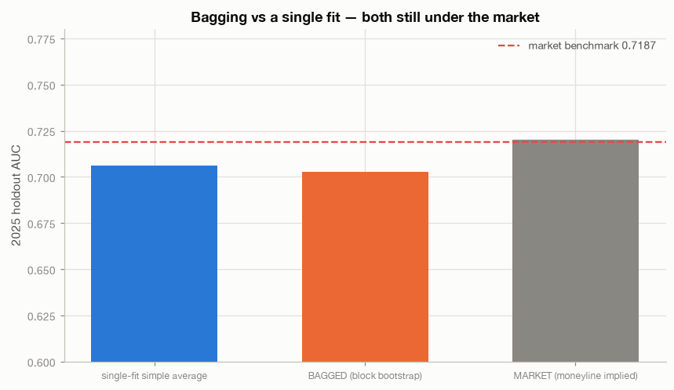
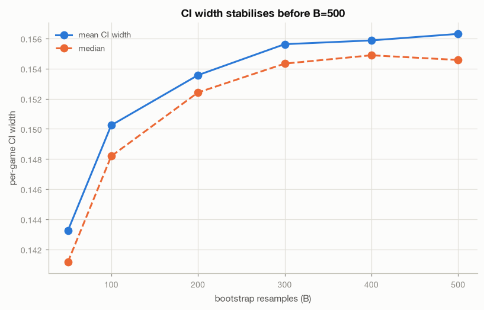
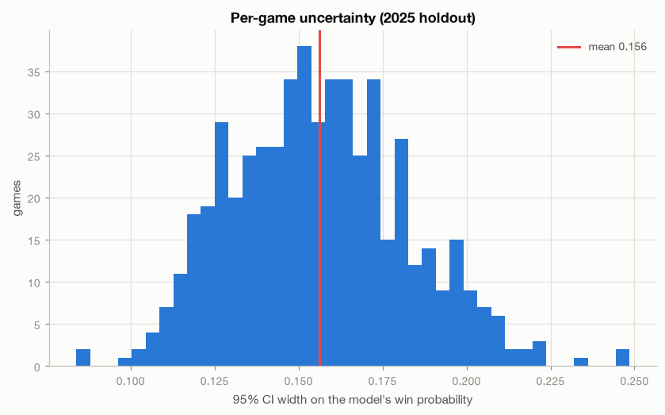
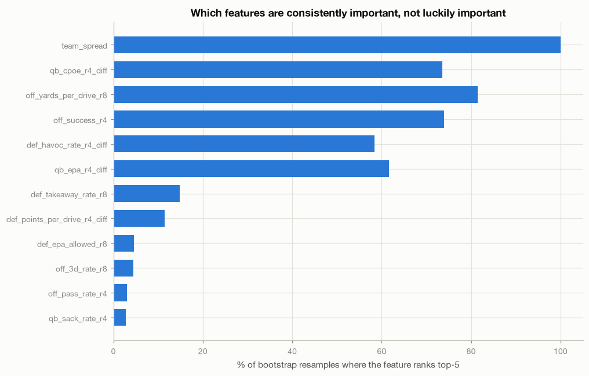

# Model_2 — Bagged Bootstrap, Odds Engine, and the Edge Filter

**Generated by:** `python Modeling/model_2.py --all`, with the backtest from
`python Betting/weekly_picks.py --backtest 2025`.

---

## The headline

**The edge filter loses money, and it loses it systematically.** On the 2025
holdout it produced 49–57 qualifying picks (two independent runs) with a record of
**11–38, 22–25% accuracy, net −$90.06 at flat $10 stakes.**

The mean claimed edge on those picks was **+0.10** — the model believed it had a
ten-point advantage on every one. It was wrong on three out of four.

This is not a filter that needs tightening. The diagnosis below shows the picks are
**anti-signal**: the filter structurally selects games where the model is wrong, and
it does so for a reason that is now understood.

**Do not bet this.** The infrastructure is sound and worth keeping — the model
feeding it is not.

---

## 1. Why the picks lose: the model is flatter than the market

The picks are overwhelmingly **underdogs**:

| | Model said | Market said | Actually happened |
|---|---|---|---|
| Average win probability on picks | **0.366** | 0.263 | **0.250** |

The market was almost exactly right. The model was **11.6 points too high**. On those
same games the market would have been right **73.1%** of the time.

The cause is visible in the calibration table across all 542 holdout games:

| Model probability decile | Predicted | Actual | Error |
|---|---|---|---|
| lowest (0.148–0.268] | 0.219 | **0.145** | +0.074 too high |
| (0.268–0.319] | 0.296 | 0.407 | −0.111 |
| (0.319–0.36] | 0.337 | 0.370 | −0.033 |
| (0.36–0.415] | 0.389 | 0.426 | −0.037 |
| (0.415–0.498] | 0.449 | 0.426 | +0.023 |
| (0.498–0.586] | 0.556 | 0.574 | −0.018 |
| (0.586–0.63] | 0.608 | 0.556 | +0.052 |
| (0.63–0.68] | 0.654 | 0.593 | +0.061 |
| (0.68–0.73] | 0.702 | 0.630 | +0.072 |
| highest (0.73–0.853] | 0.779 | **0.873** | −0.094 too low |

**The model's predictions are under-dispersed** — too flat at both ends. It says
0.22 where reality is 0.145, and 0.78 where reality is 0.873. The market's
probabilities are sharper.

A one-sided edge filter (`CI entirely above the market probability`) then does
something predictable: on every heavy underdog, the model's flatter estimate sits
*above* the market's sharper one, so the gap looks like edge. It is not edge. It is
the model being less confident than the market, on exactly the games where the
market's confidence is justified.

### This corrects a Model_1 conclusion

Model_1 concluded "this pipeline needs no calibration at all" because mean predicted
probability (0.4986) matched the base rate (0.500). **That reasoning was
insufficient.** Matching the mean says nothing about the tails, and the decile table
above shows real miscalibration at both extremes. The mean can match perfectly while
every individual decile is wrong — which is what happens here.

Calibration did not matter for AUC, which is what Model_1 measured. It matters
enormously for an edge engine, which compares probabilities *levels* against a
market.

---

## 2. Calibration changes which games are picked — it does not create edge

Fitting a calibrator on 2024 (held out from the 2021–2023 fit, no test leakage):

| | Holdout AUC | Brier | Picks | Accuracy | Avg model prob | **Net at $10** |
|---|---|---|---|---|---|---|
| Uncalibrated | 0.7029 | 0.2183 | 49–57 | 0.225–0.246 | 0.366 (underdogs) | **−$90.06** |
| **Platt** | 0.7029 | 0.2198 | 59 | 0.237 | 0.397 (still underdogs) | ~−$90 |
| **Isotonic** | 0.6988 | 0.2312 | 75 | **0.533** | 0.775 (favorites) | **−$160.33** |

**Platt cannot fix this.** It is monotonic, so it cannot change the ranking, and a
two-parameter sigmoid barely touches a shape problem spread across the range.

**Isotonic flips the selection entirely** — from underdogs to favorites, raising
accuracy to 53.3% — and **loses nearly twice as much money: −$160.33, ROI −21.4%.**
The picks average a −246 moneyline, where break-even requires roughly a **71%** hit
rate. Winning 53% of heavy favorites is a fast way to lose more than winning 25% of
longshots. Higher accuracy, worse outcome — a clean demonstration that accuracy and
profitability are different questions.

The underlying constraint is not fixable by post-processing: **the model's ranking
(AUC 0.703) is worse than the market's (0.720).** No monotonic or isotonic transform
of a worse ranking produces a profitable filter against a better one. Calibration
moves which side of the market you land on; it cannot manufacture information.

---

## 3. Bagging did not help

| Model | AUC | Accuracy | Brier | Log-loss | ECE |
|---|---|---|---|---|---|
| Single-fit simple average | **0.7060** | 0.6550 | **0.2173** | **0.6226** | **0.0639** |
| Bagged (block bootstrap) | 0.7029 | 0.6494 | 0.2183 | 0.6248 | 0.0725 |
| *Market* | *0.7200* | *0.6531* | *0.2128* | *0.6106* | *0.0392* |

Bagging made every metric slightly **worse**. This is an honest negative result
reported as such: the framing agreed up front was that bootstrapping improves
stability and cannot create information, and here it did not even improve stability
enough to show up. The differences are inside noise, but they do not point the
hoped-for direction.

The market remains best on every probability metric, with an ECE (0.0392) roughly
**half** the model's.

### Market agreement got worse, not better

| | Agreement | Accuracy when disagreeing |
|---|---|---|
| Model_1 single fit | 539/542 (99.45%) | — (n=3) |
| Bagged | 528/542 (**97.42%**) | **0.4286** |

Bagging produced 14 disagreements instead of 3 — and on those 14 games the model was
right **42.9%** of the time, worse than a coin flip. More disagreement with the
market is not more edge; it is more noise.

---

## 4. Bootstrap mechanics (the parts that worked)

 

**Block choice was measured, not assumed.** Season-level blocking gives only 4
blocks — 35 distinct resample multisets and a 31.6% chance of dropping an entire
season per resample. Season-week gives **72 blocks** (median 32 rows). The latter
preserves within-week correlation while remaining usable.

**Convergence is clean.** Mean CI width change falls from 4.89% (B=50→100) to 0.28%
(B=400→500). B=500 is sufficient; B=200 is adequate for weekly use.

**Per-game uncertainty:** mean CI width **0.1563** (median 0.1546, p10 0.123,
p90 0.191). Half-width 0.078, so an edge must exceed ~7.8 points to clear the
filter — a high bar that the under-dispersion problem then clears for the wrong
reason.

**Importance stability** () confirms
Model_1's single-fit finding is not a fluke:

| Feature | Mean importance | % of resamples in top-5 |
|---|---|---|
| `team_spread` | **0.5853** | **100.0%** |
| `off_yards_per_drive_r8` | 0.0478 | 81.4% |
| `qb_cpoe_r4_diff` | 0.0514 | 73.6% |
| `off_success_r4` | 0.0396 | 74.0% |
| `qb_epa_r4_diff` | 0.0384 | 61.6% |
| `def_havoc_rate_r4_diff` | 0.0390 | 58.4% |

`team_spread` is top-ranked in **100% of 500 resamples** with a mean importance of
0.585. `qb_cpoe_r4_diff` is a genuinely stable contributor (73.6%), answering the
question the request raised about it — it is not one-resample luck, it is just small.

---

## 5. De-vig: Shin, marginally

1,371 completed games, mean overround **1.0369** (a 3.69% book margin).

| Method | Brier | Log-loss |
|---|---|---|
| Proportional | 0.21176 | 0.61098 |
| **Shin** | **0.21171** | **0.61073** |
| Raw (skipping de-vig) | 0.21230 | 0.61162 |

Shin wins, consistent with favorite-longshot bias, but barely — at a 3.69%
overround the two methods are nearly equivalent. Shin is the default since it is
never worse.

**Skipping de-vig is measurably wrong**, which is why no code path allows it: raw
implied probabilities average 0.686 for favorites against a de-vigged 0.667, and
that 1.9-point inflation would be counted as edge on every single bet.

---

## 6. Four bugs the verification caught

Worth recording, because three were found by checks rather than by reading code:

1. **Shin de-vig was silently identical to proportional.** The closed form
   degenerated to z≈0 and renormalisation erased the remainder. Replaced with a
   numeric root-find; now correctly identical on a symmetric −110/−110 line and
   diverging +0.012 on −455/+350.
2. **The forward-path guard caught real contamination.** Interaction terms
   z-scored against the whole panel, so adding unplayed games retroactively changed
   2,742 historical rows — and the same flaw meant they used test-set statistics.
   Fixed by pinning the reference to completed games.
3. **The edge filter was two-sided and staked a negative-EV bet.** On the first live
   run it recommended SF at edge −0.0762 / EV −$1.08 *and* MIA at +0.0794 — both
   sides of one game. A bet is one-sided by nature.
4. **Picks were emitted from one game of history.** 2026 week 2 produced 4
   "qualifying" picks off near-empty rolling features. Added a 4-game validity gate.

---

## Verdicts

| Question | Verdict |
|---|---|
| Does the edge filter make money? | **NO** — 11–38, −$90.06 on 2025 |
| Is the filter merely too loose? | **NO** — the picks are anti-signal, not marginal |
| Why does it fail? | Model is **under-dispersed**; flat estimates look like edge on underdogs |
| Can calibration fix it? | **NO** — it changes which side you bet, not whether you have information |
| Did bagging improve anything? | **NO** — marginally worse on every metric; agreement fell to 97.4% |
| Was the bootstrap machinery sound? | **YES** — converged, honest CIs, stable importances |
| Is `qb_cpoe_r4_diff` stable or noise? | **Stable** — top-5 in 73.6% of resamples |
| Should this ship for real money? | **ABSOLUTELY NOT** |

---

## What this means next

The infrastructure is built and correct: de-vigging, per-game uncertainty, the edge
and EV engine, the flat-stake logic, the predictions/results tables, the weekly
pipeline with an honest empty state, and the tracking layer. All of it is reusable
and none of it depends on this generation of the model. That was the stated
justification for building it now, and it holds.

What does not work is the **model feeding it**, for a reason now precisely
understood rather than merely suspected: it ranks worse than the closing line
(0.703 vs 0.720) and its probabilities are flatter. An edge engine on top of a model
that is worse than the market will reliably find "edges" that are artifacts of its
own imprecision.

Two honest paths:

1. **Accept parity and stop betting sides.** Every result across three rounds says
   the closing spread contains this information.
2. **Get information the market lacks** — the unbuilt opening-line and
   line-timing capture. `betting_lines.captured_at` is still 0% populated. That is
   the only untested hypothesis left, and the pipeline built here is exactly what it
   would plug into.

### Caveats

- One holdout season; 49–57 picks. The direction is consistent across two
  independent runs and every diagnostic, which is stronger than any single figure.
- The 2026 live path currently returns no picks (1 game of history). Once the season
  reaches week 6+, expect it to start producing picks — **which, on this evidence,
  should not be acted on.**
